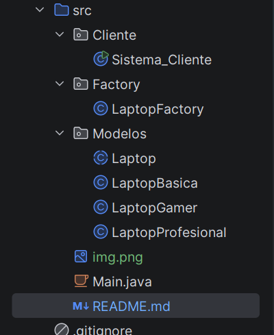
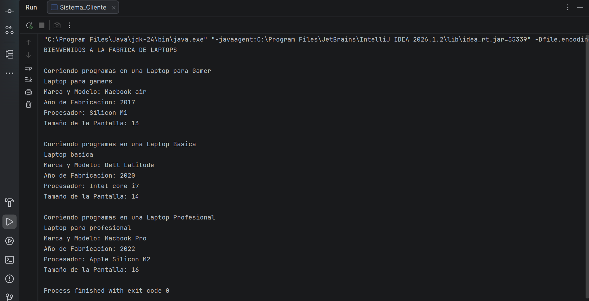

# Práctica 012 - Patrón de Diseño Simple Factory

## Descripción

Este proyecto implementa el patrón de diseño Simple Factory utilizando Java.

La aplicación crea tres tipos de laptops:

- Laptop Básica
- Laptop Gamer
- Laptop Profesional

Cada laptop posee las siguientes características:

- Marca y Modelo
- Año de Fabricación
- Tipo de Procesador
- Tamaño de la Pantalla

Cada clase sobrescribe el método `ejecutarPrueba()` para indicar el tipo de laptop creado.

---

## Patrón Utilizado

**Simple Factory**

La clase `LaptopFactory` es la encargada de crear los distintos tipos de laptops según la solicitud del cliente.

---

## Estructura del Proyecto
```
```

---
## Salida


---
## Autor

Villena Gamboa Arellys Judith 

000292454